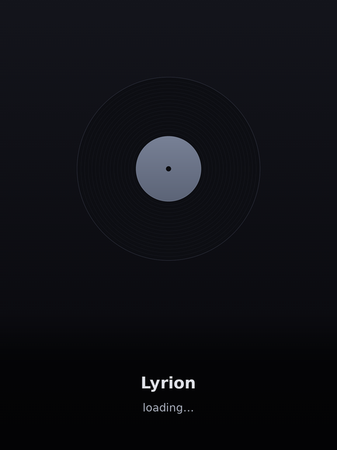

# Lyrion Cover Display

A lightweight kiosk "now playing" screen for **Lyrion Music Server (LMS)**. It
follows your LMS player(s) and draws the current **album cover** with artist /
track / album below — no desktop, no browser. Each frame is composited with
**pygame** (`SDL_VIDEODRIVER=dummy`) and copied straight to the **firmware
framebuffer** (`/dev/fb0`), light enough for a **Raspberry Pi 3 A+ (512MB)**.

| Now playing | Resting |
|:---:|:---:|
|  |  |

- **Display only** — LMS and the audio player live elsewhere on your network.
- **Portrait stacked layout:** cover on top, washed info band below; non-square
  art is blur-filled (no black bars).
- **Multi-player:** track several players by priority, show one at a time.
- **Event-driven:** updates push from the LMS CLI (port 9090), polling fallback.
- **Powers HDMI off when idle** (`vcgencmd`), wakes on play.

## Install (on the Pi)

```bash
git clone https://github.com/patapovich/lyrion-cover-display
cd lyrion-cover-display
sudo ./install.sh
```

Installs the deps (`python3-pygame python3-numpy fonts-dejavu-core`), the systemd
service, the boot-splash + `maintenance` helpers, and a copy of `config.ini`.
Then:

```bash
python3 lms_cover_display.py --list-players   # find your player's MAC
nano config.ini                               # set server_host (and player)
sudo systemctl start lms-cover-display        # ...or reboot
```

Logs: `journalctl -u lms-cover-display -f` (RAM-only, cleared on reboot).

## Configuration

Edit `config.ini` — full annotated list in
[`config.example.ini`](config.example.ini). The common keys:

| Key                  | Meaning                                                        |
|----------------------|----------------------------------------------------------------|
| `server_host`        | LMS hostname/IP (**required**)                                 |
| `player`             | Player MAC (recommended) or name; blank = first player         |
| `players`            | Several players, priority order (first = highest), comma/space separated; overrides `player`. Highest-priority *playing* one shows; preempts; sticky last-active when idle |
| `rotate`             | `0/90/180/270` for a portrait mount (default `90`)             |
| `background`         | `blur` (saturated, blurred, zoomed full-cover backdrop, lms-material style) or `black` |
| `idle_blank_seconds` | Hold last cover this long after stop, then power HDMI off (default `300`) |

Updates are event-driven via the LMS CLI (`cli_port`, default `9090`); set
`cli_user`/`cli_pass` only if your LMS has CLI auth.

## Notes

- **Hardware:** Pi 3 A+ + HDMI panel (via a scaler). Native 2048×1536 isn't
  reachable on a Pi 3 (HDMI clock cap), so it feeds the scaler `1600×1200@60`
  (`cmdline.txt`) which upscales. vc4 KMS is left off so the firmware framebuffer
  persists from power-on (no signal drop at boot).
- **Production hardening:** read-only root overlay (writes vanish on reboot, so a
  power cut can't corrupt the card — edit with `sudo maintenance rw`, then
  `sudo maintenance ro`), RAM-only logs, never-give-up systemd restart, no swap.
- **Splash assets** are generated by `python3 tools/gen_splash.py`.

## Troubleshooting

- **Black screen:** check `journalctl -u lms-cover-display -f`; reboot after
  install so `video` group + disabled `getty@tty1` take effect.
- **Wrong orientation:** set `rotate = 270` (or 90/180) and restart.
- **Config edits don't stick:** the card is read-only — `sudo maintenance rw` first.
- **"No players connected":** the player must be on and connected to LMS
  (`--list-players`).
